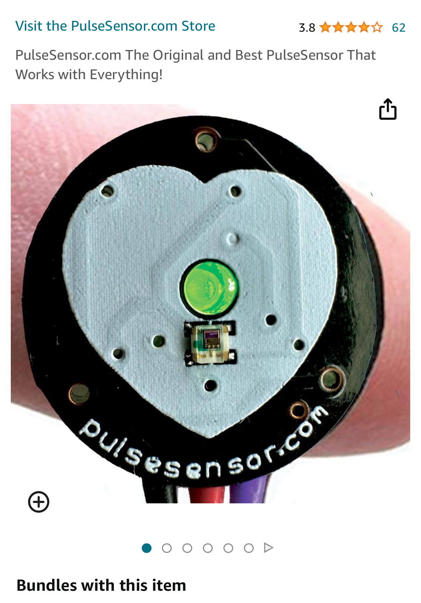
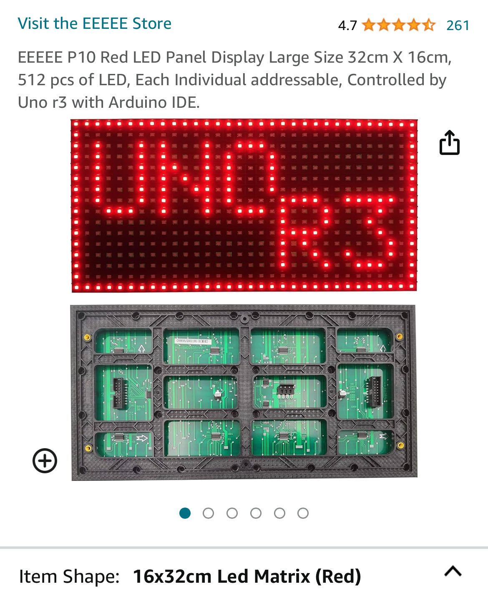

# Pet Health Monitor Duo

## Introduction

The "Pet Health Monitor Duo" is an innovative, two-part system designed to keep a watchful eye on your pet's vital health statistics. It comprises a sensor-equipped pet collar and a dedicated display device. The collar, sleek and comfortable for your pet to wear, integrates advanced Pulse and LM-35 temperature sensors, while the display device features a clear LCD screen with LED indicators, ensuring you're always informed about your pet's well-being.

## Sensor Device

The sensor device, embedded within a pet collar, uses a **Pulse Sensor** and an **LM-35 temperature** sensor connected to an Arduino Uno microcontroller. These sensors continuously monitor the pet's heart rate and body temperature. The collar's design ensures comfort for the pet while providing accurate and reliable data.

## Display Device

The display device is an **LCD screen** equipped with LED indicators. It communicates with the sensor device via Bluetooth, displaying real-time updates of your pet's heart rate and temperature. In case of any abnormalities, the LED lights flash as an alert, allowing for immediate attention and action.

#### 4. Communication Diagram and Functional Diagram

- **Communication Diagram**: This shows the Bluetooth connection between the sensor device (pet collar) and the display device, illustrating the seamless data transfer.
- **Functional Diagram**: This diagram provides a detailed overview of how the system operates, from data collection by the sensors in the collar to data display and alerts on the LCD screen.

@
